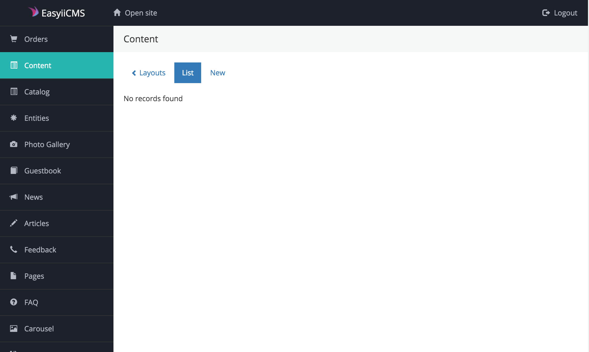
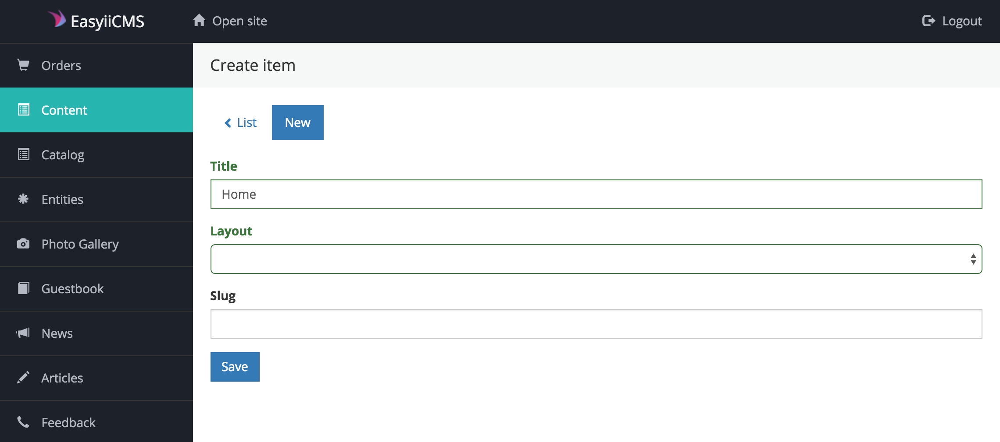
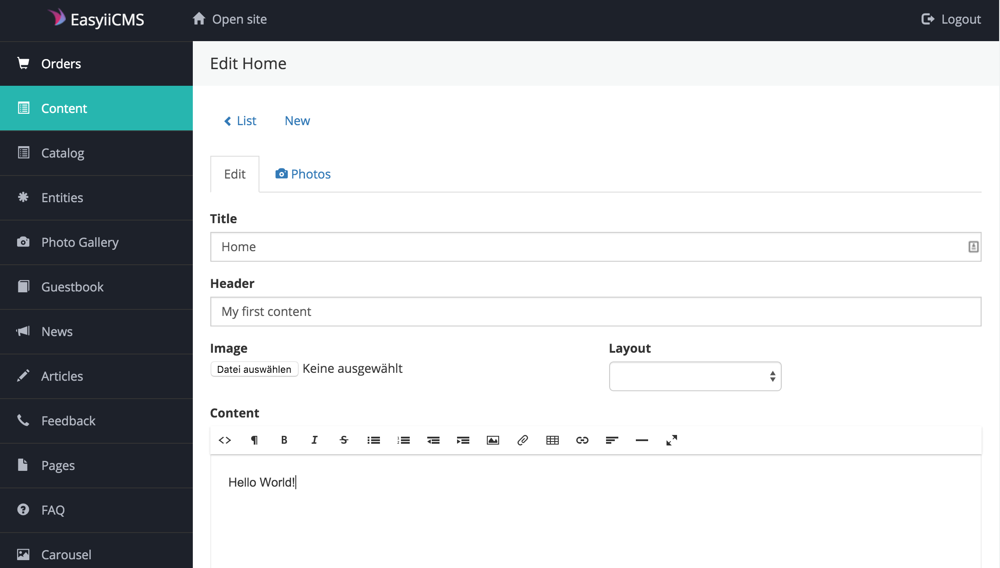

# Dev Install
## Install from git

Clone the repo

```
git clone https://github.com/boehsermoe/easyii-start
cd easyii-start
```

Make your own git repository

```
git checkout master
rm -rf .git
git init

```

Install composer

```
composer global require "fxp/composer-asset-plugin"
composer install --prefer-dist 
```

# Configuration
1. Configure database connection at `app/config/db.php`
2. Set your language at `app/config/web.php`
3. Open in browser your website url. You will see EasyiiCMS Welcome page
4. Check the requirements.
5. Fill simple form and complete installation.

### Troubleshoot
If you got PHP Notice Exceptions (Undefined index, ...), please insert following on top of `index.php`:

```
error_reporting(E_ALL ^ E_NOTICE);
```

# Get started
## Content Module

Please go in to your backend and open the "Content" module *http://www.example.com/admin* and create a "New" content item.



Create new Content with the title "Home" and save it:


Insert a header and text:


Now go in your app directory and add following to your SiteController:

```
use yii\easyii\modules\content\behaviors\ContentController;

class SiteController extends Controller
{
    use ContentController;
	...
```

Checkout your **home** content under *http://www.example.com/site/content?id=home*


### Views
To customize the default content view just create the file `app/views/site/default.php` and insert following:

```
<?php
/** 
 * @var \yii\web\View $this
 * @var \yii\easyii\modules\content\api\ItemObject $content
 */
?>

<div class="container">

	<div class="col-md-12 text-center">
		<h1><?= $content->getHeader() ?></h1>

		<?= $content->getContent() ?>
	</div>
</div>
```

You can create for each content a custom view under `app/views/site/` and the view files have to be named with the slug name of the content.
For example the view file for the **home** content is `app/views/site/home.php`

### Custom Fields

In each *layout (see below)* you can configure custom fields and the content item inherited the fields from their layout.
The field values are available as an array and the field name as key, like this: `$content->data->{field-name}` (without the braces)

### Actions
If you want your own action for your content, just named with the slug name of the content. The slug name is each to the action ID, not the action name! 
For example, **index** becomes **actionIndex**, and **hello-world** becomes **actionHelloWorld**.
See more [Yii2 Doku](http://www.yiiframework.com/doc-2.0/guide-structure-controllers.html#inline-actions)

Just add following action for the home content like this: 

```
public function actionHome()
{
	if ($this->content == null) {
	    throw new \yii\web\NotFoundHttpException(\Yii::t('easyii', 'Not found'));
	}
	
	return $this->renderContentView();
}
```

### Layouts

Under *http://www.example.com/admin/content/layout* you can create your own layouts. A layout have a title, slug and custom fields.
The template files for the layout will be search under `app/views/layouts/content/`.
If you don't have a layout, you can overwrite the default layout, just create the file `app/views/layouts/content/default.php` and insert following:

```
<?php
/**
 * @var \yii\web\View $this
 * @var string $content
 */
?>

<div class="content">
	<?= $content ?>
</div>
```

### Pretty Urls

For pretty url just add the following url rule into the `app/config/web.php`:

````
'components' => [
	'urlManager' => [
		'rules' => [
			'<id:[\d\w]+>' => 'site/content'
		]
	]
]
````

> Each content is now avaiable via *http://www.example.com/{id or slug}*

Checkout your **home** content: *http://www.example.com/home*

### Navigation

Call `Content::nav()` inside your `layouts/main.php` after the body begin. It will generate a default bootstrap navigation, with your content items. 

Please check in the backend which content item are activated for the navigation! No content item will be display in the navigation by default.

```
<?php $this->beginBody() ?>

<header>
    <?php \yii\easyii\modules\content\api\Content::nav() ?>
</header>

<?= $content ?>
<?php $this->endBody() ?>
```